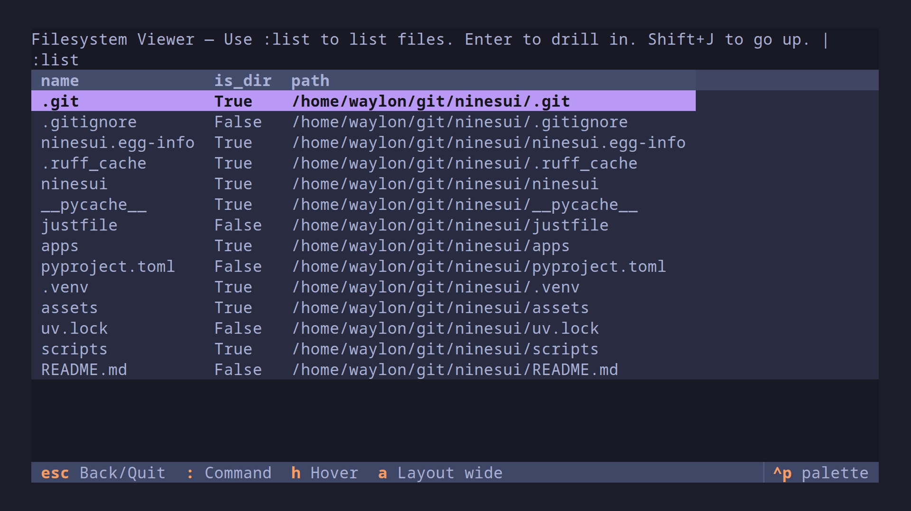

## NinesUI

_better name... eventually_

NinesUI is a framework for building `k9s` inspired TUI applications with
Pydantic classes.  Built on top of Textual.

## Git App Example

[](assets/gitnine.mp4)


## SWAPI App Example

[](assets/swapi.mp4)

## Sorting

ninesui automatically adds sort keys to your app by sorting by the first
available letter of the data.

[](assets/sort.mp4)

## Hover

Adding a `hover` method to a model will make it show a hovered display on
hover.  This can be any rich renderable.

``` python
def hover(self):
    return self
```

### Hover Hotkeys

* `h` - toggle hover
a `a` - toggle wide layout

[
